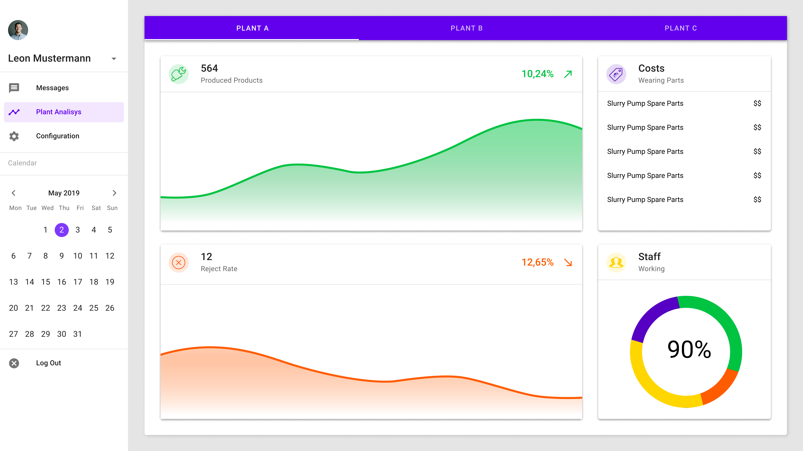

# :art: Projekt GUI (Graphical User Interfaces)


## Erste GUI-Prototypen

Eure Aufgabe ist es, eine GUI auf Basis des anfänglichen Briefings des Kunden zu erstellen:

>Unsere Geschäftsführung erhält alle relevanten Daten unserer Werke vom Controlling als Excel-Datei. Unsere Sekretärin verarbeitet diese Exceldaten zu Diagrammen und kopiert die >Exceldatei auf unseren großen Touchscreen im Hauptkonferenzraum für die täglichen Besprechungen. Wir brauchen eine zeitgemäße Lösung! Ein ausgeklügeltes, interaktives >Präsentationssystem unserer Produktionszahlen für Besprechungen. Die Exceldatei liefert folgende Informationen: die Anzahl der produzierten Einheiten, die Ausschussquoten, >Kosten für Verschleißteile und Krankmeldungen von Mitarbeitern. Diese Daten erhalten wir aus allen drei Werken täglich um 22:00 Uhr (Hinweis: Bildschirmauflösung: FullHD)

### Low Fidelity

Home:


Number Produced Products


Reject Rates


Costs of Wearing Parts


Sickness Notification (Staff Working)


### Medium Fidelity

Home:


Number Produced Products


Reject Rates


Costs of Wearing Parts


Sickness Notification (Staff Working)


### High Fidelity

Home:


Number Produced Products


Reject Rates


Costs of Wearing Parts


Sickness Notification (Staff Working)


**Interaktiver Prototyp**

[Link Interaktiver Prototyp](https://www.figma.com/proto/vT5W6zGlSqADeKLkclEqH1/GUI-Projekt?scaling=scale-down&node-id=6%3A0)


## Design Transformation Challenge


Nehmen wir nun folgendes an:
Ihr Kunde ist total verliebt in Ihre bisherige Arbeit und beauftragt Sie:

**Tablet Version**

>Es gibt einige Anwendungsfälle, bei denen der ortsgebundene Bildschirm im Besprechungsraum nicht ausreicht: wenn Besprechungen in einem anderen Büro stattfinden, zum Beispiel wenn Diskussionen über die Produktionszahlen der Anlage direkt am Fließband mit den Meistern und Vorarbeitern besprochen werden. Wir brauchen also eine Adaption dieser Großbildsysteme für Tablets.

[Tablet Prototyp](https://www.figma.com/proto/cAURnzkD0LGeQ7Mt70XyT5/GUI-Tablet?node-id=2%3A2&scaling=scale-down)

**Smartwatch Version**

>Letzte Woche haben wir die Großbildsysteme unserem Vizepräsidenten und den Senior Directors vorgestellt. Wir kamen auf die Idee, dieses System auf unseren Smartwatches laufen zu lassen. Das wäre eine tolle Aktivität in unserer digitalen Transformation, um unser Unternehmen zu fördern. Wir brauchen einen Proof of Concept für die anstehende Messepräsentation im nächsten Sommer.

[Smartwatch Prototyp](https://www.figma.com/proto/Goe2thE3389PCp60XWrGw4/GUI-Smartwatch?node-id=1%3A2&scaling=scale-down)


## Design Transformation Challenge

>Ihre Aufgabe ist es, einen Ihrer vorhandenen Bildschirme aus dem großen oder Tablet-Prototyp nach den Design-Richtlinien von Google oder Apple auszurichten. Beide Richtlinien decken mobile und Desktop-Viewports ab, für diese Aufgabe sollten Sie sich nur auf eine Viewport-Größe konzentrieren.

Home:


Material Design:




You can use the [editor on GitHub](https://github.com/KeBuck/GUI/edit/main/README.md) to maintain and preview the content for your website in Markdown files.

Whenever you commit to this repository, GitHub Pages will run [Jekyll](https://jekyllrb.com/) to rebuild the pages in your site, from the content in your Markdown files.

### Markdown

Markdown is a lightweight and easy-to-use syntax for styling your writing. It includes conventions for

```markdown
Syntax highlighted code block

# Header 1
## Header 2
### Header 3

- Bulleted
- List

1. Numbered
2. List

**Bold** and _Italic_ and `Code` text

[Link](url) and 
```

For more details see [GitHub Flavored Markdown](https://guides.github.com/features/mastering-markdown/).

### Jekyll Themes

Your Pages site will use the layout and styles from the Jekyll theme you have selected in your [repository settings](https://github.com/KeBuck/GUI/settings). The name of this theme is saved in the Jekyll `_config.yml` configuration file.

### Support or Contact

Having trouble with Pages? Check out our [documentation](https://docs.github.com/categories/github-pages-basics/) or [contact support](https://support.github.com/contact) and we’ll help you sort it out.
